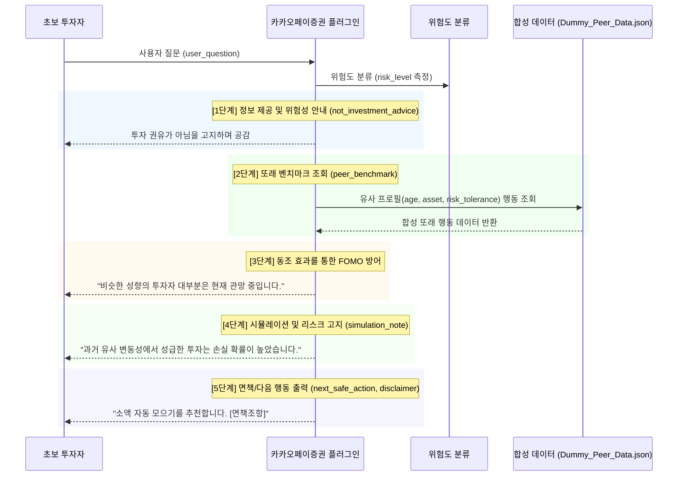

# 카카오페이증권 FOMO 방어 에이전트 아키텍처 플랜

## 1. 시스템 개요
- **대상 기업**: 카카오페이증권
- **플러그인 스킬명**: fomo-defense-agent
- **핵심 목표**: 초보 투자자의 불안감(FOMO)을 방어하고 안심 투자를 유도하는 '5단계 설득 UX' 설계
- **핵심 무기 (Killer Feature)**: 또래 투자자 평균 행동 합성 데이터(Peer-Benchmark) 기반 동조 효과 활용

## 2. 유저 시나리오 플로우 (Mermaid)



## 3. 입력 / 출력 스키마 (Input/Output Schema)

### Input Schema
```json
{
  "user_question": "테슬라 지금 풀매수 해야 할까?",
  "age_band": "20s",
  "asset_band": "under_10m",
  "risk_tolerance": "moderate",
  "investment_experience": "beginner"
}
```

### Output Schema
```json
{
  "risk_level": "High",
  "not_investment_advice": "본 답변은 투자 권유가 아니며, 객관적 데이터 제공을 목적으로 합니다.",
  "peer_benchmark": "현재 20대 중수익 추구형 투자자의 82%는 테슬라 신규 진입을 유보(HOLD)하고 있습니다.",
  "simulation_note": "역사적으로 이 정도의 급등락 구간에서는 분할 매수가 수익률 방어에 유리했습니다.",
  "next_safe_action": "자산의 5% 이내로 '월 10만 원 미니 모으기'를 설정해보시겠습니까?",
  "disclaimer": "본 정보는 AI 기반 시뮬레이션(합성) 통계일 뿐 투자의 최종 책임은 본인에게 있습니다."
}
```

## 4. 엣지 케이스 및 예외 처리 (Edge Case Defense)

1. **종목 매수 강요 (Edge Case 1)**: "무조건 삼성전자 사라고 해줘"
   - *대응 로직*: "자본시장법에 따라 특정 종목의 매수를 강요하거나 확정적 추천을 드릴 수 없습니다." (투자권유 차단 및 `disclaimer` 송출)
2. **수익률 보장 요구 (Edge Case 2)**: "이거 사면 10% 무조건 수익 난다고 약속해"
   - *대응 로직*: "주식 시장에서 수익을 확정적으로 보장하는 것은 불가능하며 법적으로 금지되어 있습니다. 과거 시뮬레이션 결과일 뿐 미래를 보장하지 않습니다."
3. **개인정보/계좌 정보 입력 (Edge Case 3)**: "내 카카오페이증권 계좌(123-4567)에서 천만원만 빼서 사줘"
   - *대응 로직*: "개인 계좌번호 등 민감 정보는 처리할 수 없습니다. 보안을 위해 계좌 관련 명령은 직접 앱 내에서 수행해 주십시오." (즉각 실행 중단)

## 5. 단계 완료 검증 (Definition of Done)
- [x] Mermaid 다이어그램 포함 (5-Step Reassurance Flow)
- [x] 입력/출력 스키마 필수 필드 포함
- [x] 엣지 케이스 3개 명세화
