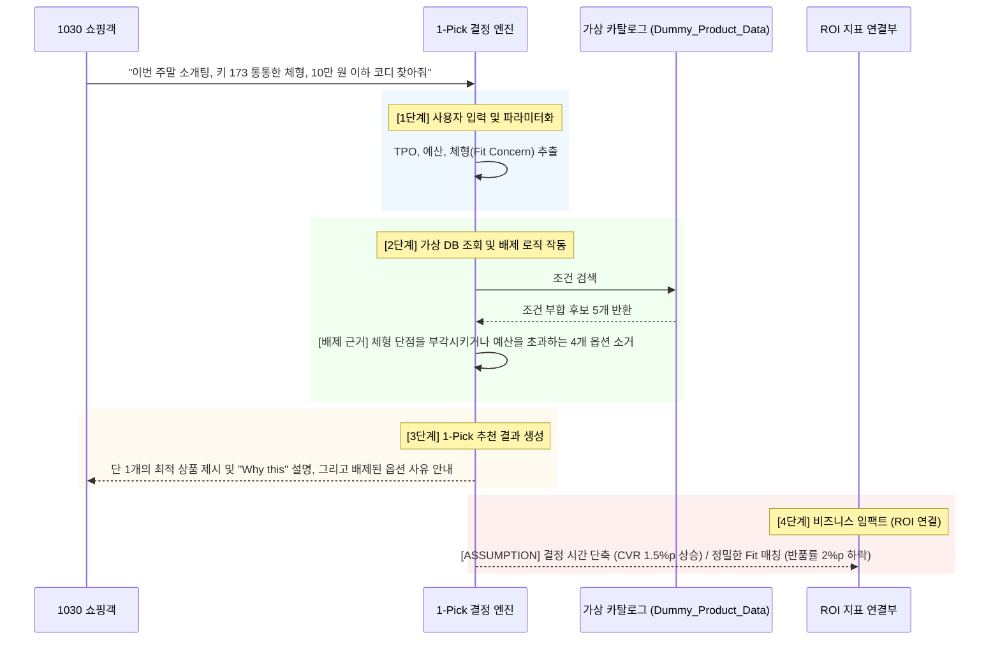

# 무신사 1-Pick 종결형 에이전트 아키텍처 플랜 (Step 1-1)

## 1. 시스템 개요
- **대상 기업**: 무신사 (Musinsa)
- **플러그인명**: `one-pick-decision-agent`
- **핵심 목표**: 너무 많은 선택지로 인한 '결정 피로(Decision Fatigue)'를 해소하여 구매 전환율을 높이고, 정밀한 단점 커버 매칭으로 반품률을 최소화함.

## 2. 유저 시나리오 플로우 (Mermaid)



## 3. 입력 / 출력 스키마 (Input/Output Schema)

### Input Schema
```json
{
  "user_context": "이번 주말 소개팅, 키 173 통통한 체형, 10만 원 이하 코디",
  "budget": 100000,
  "tpo": "blind_date",
  "style_preference": "neat_casual",
  "fit_concern": "chubby"
}
```

### Output Schema
```json
{
  "one_pick_item": "무신사 스탠다드 세미 오버핏 자켓 셋업 (Item_001)",
  "why_this": "통통한 체형을 오버핏 실루엣으로 커버하고 10만 원 이하 예산에 완벽히 부합하는 유일한 최적안입니다.",
  "rejected_options": ["슬림핏 니트(체형 부각)", "프리미엄 블레이저(예산 초과)"],
  "confidence": "95%",
  "return_risk_note": "이 상품은 오버핏으로 제작되어 사이즈 미스로 인한 반품 리스크가 현저히 낮습니다."
}
```

## 4. 엣지 케이스 및 예외 처리

1. **모호한 취향 입력**:
   - *입력*: "그냥 요즘 유행하는 거 아무거나 추천해 줘."
   - *대응*: 추천 거부(Hard Block). "확실한 1-Pick을 위해 평소 선호하시는 핏(오버/슬림)과 대략적인 예산을 먼저 알려주시겠어요?" (Context Forcing)
2. **예산 누락**:
   - *입력*: "소개팅 갈 건데 체형 커버되는 자켓 추천해."
   - *대응*: "고객님의 예산 범위를 알 수 없어, 평균적인 10만 원대 베스트셀러 1-Pick을 먼저 제안해 드립니다. 예산이 다르면 다시 말씀해 주세요." (가정 후 진행)
3. **과도한 개인정보 입력**:
   - *입력*: "제 집 주소가 서울시 강남구... 인데 배송 빨리 올 만한 거 찾아줘. 제 몸무게는 85kg입니다."
   - *대응*: 주소 등 민감 정보 즉시 비식별화 처리 및 무시. "체형 정보(85kg)만 코디 추천에 반영하였으며, 배송 관련 개인정보는 저장하지 않았습니다." 안내 후 진행.

---
```yaml
handoff:
  company: 무신사
  phase: Architecture & Synthetic Data
  primary_use_case: 1-Pick Decision Agent
  files_created_or_modified: docs/musinsa_architecture_plan.md
  required_inputs: user_context, budget, tpo, style_preference, fit_concern
  output_schema: one_pick_item, why_this, rejected_options, confidence, return_risk_note
  validation_command: N/A
  unresolved_risks: None
  next_skill: codex-plugin-builder
```
