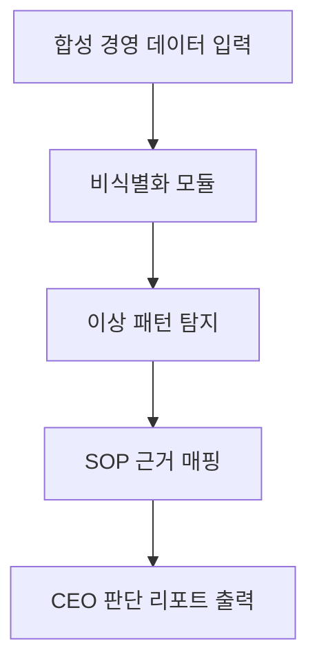

# 삼일PwC CEO Issue Judge Agent 아키텍처 플랜

## 1. 아키텍처 흐름 (Mermaid)


## 2. 입력 스키마 (Input Schema)
```json
{
  "business_unit_metrics": {
    "type": "object",
    "description": "부서별 핵심 성과 지표"
  },
  "cost_allocations": {
    "type": "object",
    "description": "부서별 원가 배분 내역"
  },
  "revenue_trends": {
    "type": "object",
    "description": "매출 추이 데이터"
  },
  "sop_snippets": {
    "type": "array",
    "description": "관련 SOP 조항 목록"
  }
}
```

## 3. 출력 스키마 (Output Schema)
```json
{
  "hidden_issue": {
    "type": "string",
    "description": "발견된 숨겨진 이슈 또는 비정상 패턴"
  },
  "evidence": {
    "type": "string",
    "description": "데이터 기반 객관적 증거"
  },
  "sop_reference": {
    "type": "string",
    "description": "판단 근거가 되는 SOP 조항 번호 및 원문"
  },
  "business_impact": {
    "type": "string",
    "description": "해당 이슈가 미치는 비즈니스적 임팩트"
  },
  "recommended_action": {
    "type": "string",
    "description": "CEO가 취해야 할 객관적 권고안"
  },
  "review_required": {
    "type": "boolean",
    "description": "인간(컨설턴트)의 추가 검토 필요 여부"
  }
}
```

## 4. 엣지 케이스 방어 시나리오 (Edge Cases)
1. **민감 기업명 포함**: 
   - 사용자가 실제 고객사나 임원명을 쿼리에 입력했을 경우.
   - 방어 로직: 비식별화 모듈에서 필터링 후, `review_required: true`로 마킹하며 리포트 내에 경고 문구를 포함시킴.
2. **SOP 근거 없음**:
   - 발견된 데이터 패턴에 매핑되는 SOP 조항이 존재하지 않을 경우.
   - 방어 로직: 결론을 자의적으로 단정하지 않고 `sop_reference: "매핑되는 SOP 없음"`으로 반환 후, 반드시 `review_required: true` 처리.
3. **상충되는 데이터**:
   - 매출과 원가가 동시에 급증하는데 다른 지표와 모순을 보이는 등 상충되는 결과가 입력될 경우.
   - 방어 로직: 어느 한쪽의 손을 들어주지 않고 두 데이터의 상충 내역을 `hidden_issue`로 추출하여, 추가 조사가 필요한 영역임을 리포트함.
